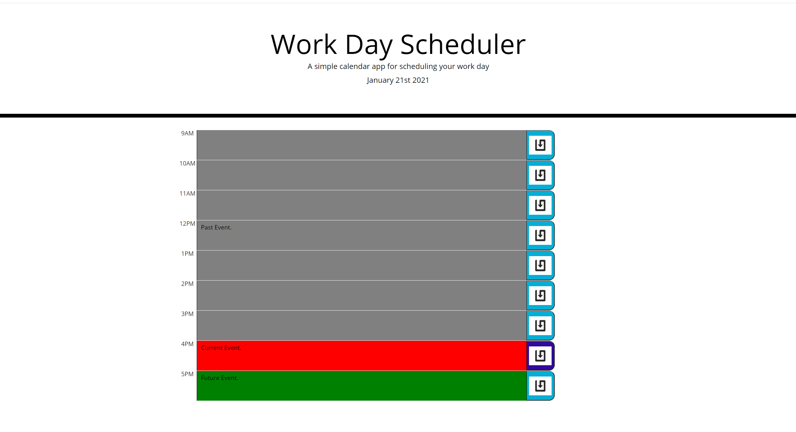

# Work-Day-Scheduler

A 9-to-5 work day planner made with JavaScript, JQuery, and Bootstrap.

When the user opens the planner the current day is displayed at the top. When the user scrolls down they are presented with time blocks for standard business hours. Each time block is color-coded to indicate whether it is in the past, present, or future. When a time block is clicked the user may enter an event. When the save button for the time block is clicked the information in the text box is saved to local storage. When the page is refreshed the saved event persists. 

Link to deployed page <>

